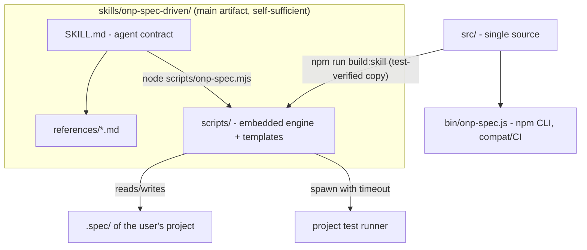

# TDD — onp-spec-driven as a pure harness skill for Claude Code

| Field        | Value                                                        |
| ------------ | ------------------------------------------------------------ |
| Tech Lead    | @vitormanoel                                                 |
| Team         | Vitor Manoel (O Novo Programador)                            |
| Epic         | Skill-first refactor (after the exhaustive 17/07/2026 test)  |
| Status       | Approved (self-approved — solo project)                      |
| Created      | 2026-07-17                                                   |
| Updated      | 2026-07-17                                                   |

## Context

onp-spec-driven is ONP's *spec-anchored* SDD tool: the spec is mechanically audited
against the code (US→AC→T→test traceability, executable DoD, verifiable
constitution). Today it is delivered as an **npm CLI**
(`@onovoprogramador/onp-spec`) plus a thin skill (`skills/onp-spec-driven/`) that
only directs the agent to call the CLI via `npx`.

A battery of ~80 adversarial scenarios (17/07/2026, see
`docs/ACHADOS-teste-exaustivo.md`) showed that (a) the mechanical engine is solid
at its core — 41/41 own tests, 100% benchmark (9/9), 600 ACs scale in 52ms — but
(b) it has 5 critical holes that allow **gate bypass or false verdicts**, and (c)
the skill, as-is, is **dead letter without the installed CLI**: in a sandbox,
offline, or in a project that never ran `npm i`, the agent has no way to execute
the contract. The product decision is: **the skill no longer depends on an
installed CLI and becomes the main artifact**, self-sufficient inside
`.claude/skills/`.

**Domain**: AI-assisted development tooling (ONP Spec-Driven workshop material).
**Stakeholders**: Vitor (author/instructor), workshop students (skill users in
their own projects), agents (Claude Code/Cursor) that run the flow.

## Problem Definition

### Problems we are solving

- **P1 — Inert skill without a CLI**: SKILL.md instructs `onp-spec ...` /
  `npx ...`. Without the package installed (sandbox, offline, new project), the
  agent improvises or ignores the gate. Impact: the differentiator ("the machine
  proves") silently switches off.
- **P2 — Gate bypass (critical CR-1..CR-5 from findings)**:
  - `skip`/`todo` tests count as PASS proof (`# SKIP` is `ok` in TAP);
  - `[concluída]` with accent silently becomes `pendente`;
  - `audit --json` truncates output >8KB (`process.exit` before flush) — blind CI;
  - pathological regex in the constitution freezes the audit (ReDoS, 60s+);
  - base preset requires a `@principle:P-001` test the flow never creates → the
    gate **never** closes on the happy path and users learn to ignore it.
- **P3 — False positives that erode trust (AL-1..AL-7)**: macOS NFD breaks
  "Então"; path with space explodes into `ARQUIVO_INEXISTENTE`; indented GWT
  becomes `AC_INCOMPLETO`; glob typo silently disables a principle; unknown level
  `[OBRIGATORIO]` disappears; missing Assumptions/Questions sections slip through
  (differentiator #3 is not enforced).
- **P4 — Skill without an operational contract for the agent**: no bounded
  correction loop, no per-task atomic commits, no context strategy, no graceful
  degradation when `node` does not exist.

### Why now?

- The skill is central workshop material (edition in progress) — students will
  copy it into real projects as early as August/2026.
- The public benchmark claims "the agent cannot declare victory"; CR-1 (skip =
  proof) falsifies the claim today.

### Impact of not solving

- **Business**: the workshop demo breaks on the first `audit --ci` (CR-5) and the
  sales thesis ("100% detection") is vulnerable to a trivial counter-example.
- **Technical**: every project that installs the skill via `init --agents` freezes
  a copy with the bugs (SK-5 drift).
- **Users**: false `AC_INCOMPLETO` on correct specs (NFD) teach users to distrust
  the audit — the opposite of the product.

## Scope

### ✅ In scope (V1)

- Self-sufficient skill in `skills/onp-spec-driven/`: rewritten SKILL.md
  (harness-first), references, **embedded mechanical engine** in `scripts/`
  (zero dependencies, runs with the environment `node` — no npm/npx/install).
- Fix of the 5 criticals (CR-1..CR-5) and the 7 highs (AL-1..AL-7) in the engine
  (`src/`), which remains the single source of truth.
- Generated sync `src/ → skills/onp-spec-driven/scripts/` with a test that fails
  if they diverge (kills SK-5).
- Operational agent contract in SKILL.md: bounded correction loop (3 iterations),
  atomic commit per task, final gate with pasted output, graceful degradation
  without `node`.
- New findings: `GLOB_SEM_ARQUIVOS`, `NIVEL_INVALIDO`, `SECAO_AUSENTE`,
  `FEATURE_DIVERGENTE`, `PROVA_FRACA`, `ID_CURTO`, `TASK_STATUS_INVALIDO`.
- Global ref semantics (IDs are global → cross-feature refs resolve, MD-1).
- Regression tests for every fixed finding (the adversarial battery becomes the
  suite).

### ❌ Out of scope (V1)

- Removing/unpublishing the npm CLI (it continues to exist for pure CI; becomes a
  consumer of the same `src/`).
- Native Windows support (`\` paths) beyond what already exists.
- New test reporters (keeps tap, vitest-json, jest-json, exitcode).
- Translating the skill to English.
- Self-evolving lessons/memory TLC-style (left for V2).

### 🔮 Future (V2+)

- `verificação(auditoria)` with semantic queries; watch mode; lessons layer;
  `--agents cursor` installer.

## Technical Solution

### Architecture vision

Dependency inversion: today `skill → global CLI`; it becomes
`skill ⊃ engine` (the engine travels inside the skill) and `CLI → same engine`
(compat).

**Components**:

- `SKILL.md` — the agent contract: phases, auto-sizing, gate, degradation. Never
  mentions npm/npx; resolves `scripts/` relative to the skill's own directory.
- `scripts/onp-spec.mjs` + `scripts/lib/` + `scripts/templates/` — generated copy
  of `src/` + `templates/` (embedded engine). Zero dependencies; single
  requirement: Node ≥ 18 present in the environment (already a requirement of JS
  projects; for non-JS projects the structural audit still works — only `verify`
  depends on the stack runner).
- `src/` — single source; receives all fixes.
- `tools/build-skill.mjs` — generates `scripts/` from `src/`+`templates/`;
  `test/skill-sync.test.js` fails if `scripts/` diverges from the generated copy.

### Central decision: embedded mechanical engine (not "agent audits by hand")

The alternative "the agent does the audit by reading files" was **rejected**: the
product exists precisely because the author cannot be the verifier. Proof must
come from a deterministic process outside the model (exit code), otherwise we
regress to "trust the agent's word". The embedded engine preserves this without
requiring installation: copying the skill folder is the entire installation.

### Engine fixes (contracts, per finding)

| Finding | Fix (observable contract) |
|---|---|
| CR-1 | TAP/JSON parser recognizes `# SKIP`/`# TODO`/`skipped`/`todo`/`pending` → `skip` verdict. `skip` **never** becomes PASS proof; audit reports `AC_SEM_PROVA` citing the skip. Per-tag rule: any `fail` → fail; else any `pass` → pass; else → skip. |
| CR-2 | Task status normalized (lowercase + accentless): `concluída`/`Concluida` ⇒ `concluida`. Unknown token in `[...]` ⇒ `TASK_STATUS_INVALIDO` (error) — never silently degrade to `pendente`. |
| CR-3 | `bin` and embedded entrypoint use `process.exitCode` (never `process.exit()` after writing to stdout) → complete output guaranteed in pipe/CI. |
| CR-4 | Constitution regex checks run in a subprocess with timeout (5s per check); overflow ⇒ `VERIFICACAO_MALFORMADA` ("regex exceeded the time limit") instead of freezing the gate. |
| CR-5 | Base preset: P-001 switches to `verificação(gate)` — satisfied by the audit mechanism itself (documented as intrinsic). `scaffold` also generates a test skeleton for every existing `verificação(teste)` without a tag ⇒ happy path closes with exit 0 without hidden steps. |
| AL-1 | All read content is normalized to `NFC` before parsing (specs, tasks, constitution, annotations). |
| AL-2 | `Arquivos:` splits **only by comma** (spaces in paths are valid); backticks still removed. |
| AL-3 | GWT clauses and task fields accept indentation and `-`/`*` markers; `**dado**`/`**DADO**` accepted (case-insensitive match). |
| AL-4 | Glob of `verificação(proibido/obrigatório)` matching 0 files ⇒ `GLOB_SEM_ARQUIVOS` (warning). |
| AL-5 | `## P-xxx [LEVEL]` with a level outside DEVE/RECOMENDADO/PODE ⇒ `NIVEL_INVALIDO` (error) — never ignore. |
| AL-6 | Missing `## Suposições` and `## Perguntas em aberto` sections ⇒ `SECAO_AUSENTE` (warning in draft; error with status ≥ `pronta`). Explicit "Nenhuma." satisfies it. |
| AL-7/MD-6 | Proof by `exitcode` method is only granted to an AC with an annotated test, and every `exitcode` proof generates `PROVA_FRACA` (warning) — comment+exitcode bypass closed. |
| MD-1 | Refs resolve against the **global** set of IDs (IDs are already global); AC coverage likewise. |
| MD-2 | `> feature:` ≠ directory name ⇒ `FEATURE_DIVERGENTE` (warning). |
| MD-3 | 1–2 digit IDs in headings ⇒ `ID_CURTO` (warning, "use 3+ digits"). |
| MD-4 | `verify` with 0 matched tags prints an explicit hint: "no test title contains `@spec:AC-xxx` — the tag goes in the test TITLE". |

### Skill contract (rewritten SKILL.md)

- **Flow**: Specify → (Design) → (Tasks) → Execute → **Audit**, with auto-sizing
  and a safety valve (if listing steps shows >5 steps or dependencies, go back and
  create `tasks.md`).
- **Non-negotiable gate**: last action of any feature = run the audit in CI mode
  and **paste the output**; exit ≠ 0 ⇒ not ready.
- **Bounded loop**: at most 3 fix→re-audit cycles; still failing ⇒ stop and
  present findings to the user (never loosen a test/principle).
- **Execution**: 1 task = 1 atomic commit; test first (scaffold), then
  implementation until the runner passes.
- **Context**: references loaded on demand per phase; never load two specs from
  different features simultaneously.
- **Graceful degradation**: no `node` in the environment ⇒ the skill instructs a
  manual checklist of the same findings, with the result explicitly marked as
  `WEAK PROOF (manual audit)` — never silent.

### Data/format changes

- `.spec/` unchanged (full compat with existing projects).
- `verification/<feature>.json`: `status` field gains a `skip` value; the existing
  `method` field becomes required on read (missing ⇒ treated as weak).
- Findings catalog: + `GLOB_SEM_ARQUIVOS`, `NIVEL_INVALIDO`, `SECAO_AUSENTE`,
  `FEATURE_DIVERGENTE`, `PROVA_FRACA`, `ID_CURTO`, `TASK_STATUS_INVALIDO`
  (documented in ARQUITETURA.md).

## Risks

| Risk | Impact | Prob. | Mitigation |
|---|---|---|---|
| `scripts/` copy diverges from `src/` (drift) | High | Medium | Generated build + `skill-sync.test.js` that fails the suite on divergence; regeneration is one command |
| Accepting variants (accent/case/indentation) creates new ambiguity | Medium | Medium | Normalization documented in the grammar; regression tests for each accepted and each rejected variant |
| Timeout subprocess per regex check slows the audit | Low | High | Only `proibido`/`obrigatório` checks pay the cost (~50ms each); budget measured in the scale test (600 ACs < 2s) |
| Ref semantics change (local→global) changes existing audit results | Medium | Low | Only removes false errors (REF_QUEBRADA of a valid ref); never adds a new error; explicit changelog |
| `verificação(gate)` misunderstood (looks "free") | Low | Medium | Preset documentation explains it is satisfied by the audit mechanism; LGPD keeps real tests |
| Non-JS projects without `node` lose the mechanical gate | Medium | Low | Explicit graceful degradation (WEAK PROOF) + structural audit still runnable in any Node CI |

## Test Strategy

| Type | Scope | Approach |
|---|---|---|
| Unit | parsers (TAP skip/todo, normalized status, NFC, comma in Arquivos, levels) | `node:test`, cases derived 1:1 from findings |
| Unit | audit (new findings, global refs, missing section, weak proof) | in-memory fixtures |
| Integration | CLI/embedded entrypoint end-to-end in a sandbox (init→new→scaffold→verify→audit exit 0) | real process, real TAP |
| Adversarial regression | the ~80 lab scenarios become `test/adversarial.test.js` (the 12 that failed MUST pass) | per-scenario sandbox |
| Sync | `scripts/` ≡ build of `src/` | per-file hash |
| Benchmark | 100% (9/9) and clean baseline preserved | `node benchmark/run.js` |

**Critical scenarios**: skip never proves; `[concluída]` closes the right gate;
600-AC JSON intact through a pipe; ReDoS does not freeze; happy path (init base →
new → scaffold → implement → verify → audit --ci) exits 0 without a hidden step.

## Implementation Plan

| Phase | Task | Verifiable output |
|---|---|---|
| **F1 — Engine** | Fix CR-1..CR-4, AL-1..AL-7, MD-1..MD-4 in `src/` + regression tests | green `node --test` suite including new cases |
| | Base preset with `verificação(gate)` + principle-test scaffold (CR-5) | happy path closes with exit 0 |
| **F2 — Packaging** | `tools/build-skill.mjs` (src+templates → scripts/) + sync test | `skill-sync.test.js` green |
| **F3 — Skill** | Rewrite SKILL.md (harness-first, no npx) + updated references | manual review + agent smoke |
| **F4 — Validation** | Full adversarial battery re-run against the embedded engine | 0 remaining critical/high findings |
| | Benchmark + suite + happy-path E2E | all green, pasted output |

Dependencies: F2 depends on F1; F4 closes the loop (same yardstick as the findings).

## Dependencies

| Dependency | Type | Status | Risk |
|---|---|---|---|
| Node ≥ 18 in the agent environment | Runtime | Present in Claude Code | Low |
| User project test runner (verify) | External | Varies by stack | Medium — documented degradation |
| No npm package | — | zero-dep maintained | — |

## Open Questions

| # | Question | Current position | Status |
|---|---|---|---|
| 1 | Rename the installed skill to avoid collision with the TLC `spec-driven` in projects that have both? | Keep `onp-spec-driven` (name already distinct) and declare the boundary in the description | ✅ Resolved |
| 2 | Should the npm CLI be deprecated in the docs? | No — it becomes "CI mode"; the skill is the main path | ✅ Resolved |
| 3 | Lessons layer (TLC style) in this version? | V2 — out of scope | ✅ Resolved |
| 4 | Accept 1–2 digit IDs instead of only warning? | Warning only (`ID_CURTO`) — changing the grammar breaks visual uniqueness | ✅ Resolved |

## Rollback Plan

- The refactor is additive and versioned in git on the `onp-spec-driven` repo;
  rollback = `git revert` of the range (no data migration — users' `.spec/` does
  not change format).
- The published npm CLI remains functional throughout the transition; if the
  embedded skill regresses in the field, the old (CLI-first) SKILL.md returns via
  revert while the engine is fixed.
- Rollback trigger: any critical adversarial-battery scenario (CR-*) regressing,
  or benchmark < 100%.
